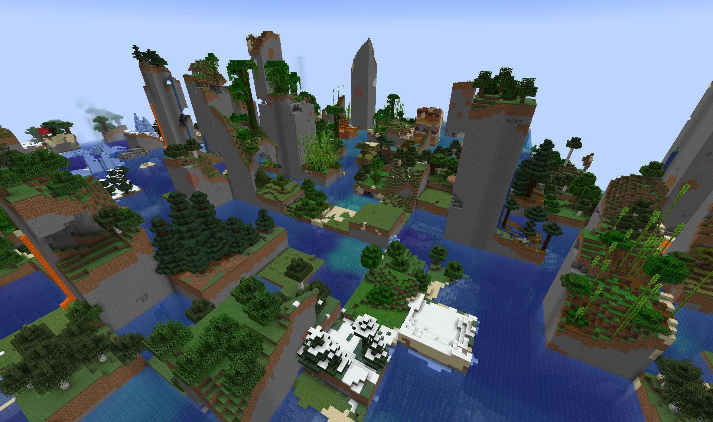

# Random Chunks

Randomizes chunks, yo. Cryptographically proven to bijectively randomize your chunks and generate them in a mostly completely entirely random location, no chunk left behind. Does so to any dimension it can find, really. Was this mod just an excuse to break out the all-time classic, _An Introduction to Mathematical Cryptography 2nd Ed_, and incorporate finite fields into a Minecraft mod? Absolutely, entirely, yes. Was it overkill and completely unnecessary? Also yes.

